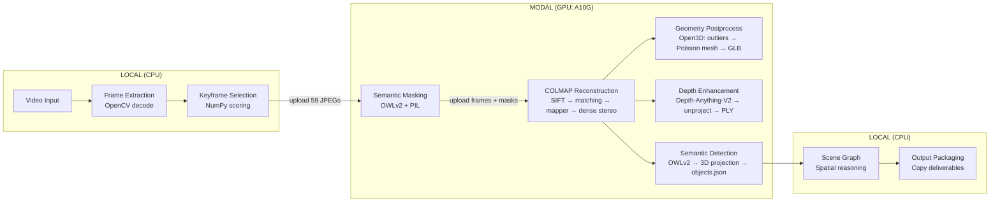

# God's Eye Pipeline — Technical Performance Analysis

## 1. Architecture Summary

God's Eye is a **hybrid local/cloud 3D reconstruction pipeline** that ingests monocular drone video and produces metrically accurate, semantically enriched 3D environments. The architecture splits into:

- **Local control plane** (your Windows machine): video decode, keyframe curation, orchestration, scene graph, packaging
- **Remote compute plane** (Modal serverless GPUs — NVIDIA A10G, 24GB VRAM): COLMAP SfM, Poisson meshing, depth estimation, semantic detection



**Critical insight**: This is **NOT a traditional video-processing pipeline** (decode → per-frame inference → encode). It's a **3D reconstruction pipeline** where the bottleneck is COLMAP's dense stereo, not model inference on every frame. The pipeline processes ~60–200 *keyframes*, not every frame of the video.

---

## 2. Baseline Timing Data (from real run: `20260916-033539-fbeff1`)

**Input**: `sample4.mp4` — 9.76s, 25 fps, 848×480, h264, 1.5 MB
**Total end-to-end**: **29 minutes 20 seconds** (1760s)

| Stage | Wall Clock | Remote Compute | % of Total | Target | Blocking? |
|---|---:|---:|---:|---|---|
| **Job Setup** | 0.002s | — | 0.0% | LOCAL/CPU | Yes |
| **Frame Extraction** | 0.32s | — | 0.0% | LOCAL/CPU | Yes |
| **Keyframe Selection** | 0.90s | — | 0.1% | LOCAL/CPU | Yes |
| **Semantic Masking** | 353.9s | 70.2s | **20.1%** | MODAL/A10G | Yes (serial) |
| **COLMAP Reconstruction** | 1204.5s | 1137.5s | **68.4%** | MODAL/A10G | Yes (serial) |
| **Geometry Postprocess** | 79.5s | 43.1s | **4.5%** | MODAL/CPU | Yes (serial) |
| **Depth Enhancement** | 58.6s | 25.7s | **3.3%** | MODAL/A10G | Yes (serial) |
| **Semantic Detection** | 62.5s | 45.7s | **3.6%** | MODAL/A10G | Yes (serial) |
| **Scene Graph** | 0.01s | — | 0.0% | LOCAL/CPU | Yes |
| **Output Packaging** | 0.15s | — | 0.0% | LOCAL/CPU | Yes |
| **TOTAL** | **1760.4s** | **~1322s** | 100% | | |

### Wall Clock vs Remote Compute Breakdown

The **wall clock** includes three components for every remote stage:
1. **Upload** — push keyframes/data to Modal Volume
2. **Remote compute** — the actual GPU work
3. **Download** — pull results back from Modal Volume

For example, **Semantic Masking** took 353.9s wall clock but only 70.2s of actual GPU compute. The remaining ~284s was:
- Container cold start (first function call spins up the container image)
- Volume I/O (upload 59 frames, download 60 mask files)
- Modal function spawn + poll overhead

---

## 3. The Bottleneck (Measured, Not Guessed)

### 🔴 COLMAP Dense Stereo = 63% of entire runtime

Inside the COLMAP reconstruction stage, the internal timings are:

| COLMAP Sub-stage | Time | Notes |
|---|---:|---|
| Feature Extraction (SIFT, GPU) | 2.8s | Fast, GPU-accelerated |
| Exhaustive Matching (GPU) | 2.4s | Fast for 59 images |
| Mapper (sparse SfM) | 12.2s | CPU-bound, sequential |
| Image Undistortion | 1.4s | CPU |
| **Patch-Match Dense Stereo** | **1107.9s** | **🔴 THE BOTTLENECK** |
| Stereo Fusion | 7.9s | CPU |
| **Total COLMAP compute** | **1137.5s** | |

**Patch-Match Dense Stereo alone consumed 18.5 minutes** (63% of the entire 29-minute run) for a **10-second, 480p video with only 59 keyframes**.

### 🟡 Cold Start Overhead = ~15% of runtime

Each Modal stage spins up a separate container. For stages like Semantic Masking (353.9s wall, 70.2s compute), approximately **280s was cold start + data transfer overhead**. This repeats for every stage because each runs sequentially and may spawn on different containers.

### 🟢 Everything Else is Fast

Local stages (frame extraction, keyframe selection, scene graph, packaging) combined: **~1.4 seconds**. Not a bottleneck.

---

## 4. GPU Usage Analysis

### What actually uses the GPU

| Component | Framework | GPU? | Precision | Batching | CUDA Streams | torch.compile | inference_mode |
|---|---|---|---|---|---|---|---|
| COLMAP SIFT Extraction | COLMAP (C++) | ✅ A10G CUDA | FP32 | Internal | N/A (subprocess) | N/A | N/A |
| COLMAP Matching | COLMAP (C++) | ✅ A10G CUDA | FP32 | Internal | N/A | N/A | N/A |
| COLMAP PatchMatch Stereo | COLMAP (C++) | ✅ A10G CUDA | FP32 | Internal | N/A | N/A | N/A |
| Depth-Anything-V2 | PyTorch + Transformers | ✅ A10G | FP32 | ❌ batch=1 | ❌ No | ❌ No | ❌ No |
| OWLv2 (masking) | PyTorch + Transformers | ✅ A10G | FP32 | ❌ batch=1 | ❌ No | ❌ No | ❌ No |
| OWLv2 (detection) | PyTorch + Transformers | ✅ A10G | FP32 | ❌ batch=1 | ❌ No | ❌ No | ❌ No |
| Geometry (Open3D) | Open3D (CPU) | ❌ CPU only | FP64 | N/A | N/A | N/A | N/A |

### GPU Efficiency Problems

1. **Depth-Anything-V2 processes frames one at a time** (`pipeline(pil_img)` per frame in a loop — `depth/worker.py:198`). No batching.
2. **OWLv2 processes frames one at a time** (`pipeline(pil_img, ...)` per frame — `semantics/worker.py:185`). No batching.
3. **No `torch.inference_mode()` or `torch.no_grad()`** anywhere in the worker code.
4. **No FP16/BF16** — all inference runs in FP32, wasting half the A10G's tensor throughput.
5. **No `torch.compile()`** — could provide 1.5-3x speedup for the transformer models.
6. **The Transformers `pipeline()` API** is convenient but slow — it adds per-call overhead for tokenization, preprocessing, and result packaging.
7. **COLMAP is a black box** — it's a C++ subprocess. We can only tune it through CLI flags, not via CUDA streams or batching.

### CPU↔GPU Transfers

- **Depth worker**: Loads image as PIL → sends to GPU via pipeline → gets depth tensor → converts to NumPy → does projection on CPU. The depth result crosses the GPU→CPU boundary once per frame. This is acceptable.
- **Semantic workers**: Same pattern — PIL image → GPU inference → results to CPU. Acceptable.
- **No pinned memory** or **non_blocking transfers** are used anywhere.

---

## 5. Scaling Analysis: What Happens with a 10-Minute Video?

**Your `sample4.mp4` is only 9.76 seconds long and already takes 29 minutes.**

For a 10-minute (600s) video at 25 fps:
- Total frames: ~15,000
- At 6 fps sampling: ~3,600 candidates
- After keyframe selection (target 200, max 400): ~200 keyframes

### Estimated stage times for 200 keyframes:

| Stage | Scaling Behavior | Estimated Time |
|---|---|---|
| Frame Extraction | O(n_frames) — linear | ~5s |
| Keyframe Selection | O(n_candidates) — linear | ~30s |
| Semantic Masking | O(n_keyframes) — linear, per-frame OWLv2 | ~12-15 min (cold start + 200 frames @ ~3s/frame) |
| **COLMAP Dense Stereo** | **O(n² to n³)** — pairwise stereo | **4-12+ hours** |
| Geometry Postprocess | O(n_points) — scales with point cloud size | ~5-15 min |
| Depth Enhancement | O(n_keyframes) — linear, per-frame | ~3-5 min |
| Semantic Detection | O(n_keyframes) — linear, per-frame | ~3-5 min |

> [!CAUTION]
> **COLMAP PatchMatch Dense Stereo has superlinear scaling (roughly O(n²) in image count).** 59 keyframes took 18 minutes. 200 keyframes at 1920px will take **hours, not minutes**. This is the single biggest obstacle to your 15-minute target.

---

## 6. The Pipeline is Fully Sequential

The runner in `runner.py` (line 91) iterates through stages in a `for` loop:

```python
for stage in self.stages:
    ...
    outcome_status = self._run_stage(stage, report)
```

**Every stage blocks the next.** There is zero parallelism between stages, even where data dependencies would allow it. For example:

- **Depth Enhancement** and **Semantic Detection** both read from the same COLMAP reconstruction output and do not depend on each other — they could run **concurrently**.
- **Geometry Postprocess** reads only from the COLMAP output — it could run **concurrently** with Depth Enhancement and Semantic Detection.

### Current stage dependency graph (actual data dependencies):

```
Frame Extraction → Keyframe Selection → Semantic Masking ─┐
                                                           ├→ COLMAP Reconstruction
                                        (frames uploaded) ─┘
                                                               │
                                              ┌────────────────┼────────────────┐
                                              ↓                ↓                ↓
                                        Geometry Post    Depth Enhance    Semantic Detect
                                              │                │                │
                                              ↓                ↓                ↓
                                              └────────────────┴───→ Scene Graph
                                                                         │
                                                                    Output Packaging
```

**Three stages can run in parallel after COLMAP** (Geometry, Depth, Semantics), but today they run sequentially, adding ~200s of unnecessary serial execution.

---

## 7. Modal Cold Start Problem

Each Modal function call incurs:
1. **Container cold start**: First call after deploy warms up the container (~30-120s depending on image size)
2. **Model loading**: Transformers models are loaded fresh every invocation (OWLv2 ~15-30s, Depth-Anything ~10-20s)
3. **Volume reload**: `jobs_volume.reload()` at the start of every worker

**Observed overhead per stage (wall clock − compute time)**:

| Stage | Overhead | Likely Cause |
|---|---:|---|
| Semantic Masking | ~284s | Cold start + OWLv2 model load + volume I/O |
| COLMAP Reconstruction | ~67s | Container start + volume I/O |
| Geometry Postprocess | ~36s | Container start + download 129 MB |
| Depth Enhancement | ~33s | Cold start + model load + volume I/O |
| Semantic Detection | ~17s | Warm container (same image as masking) |

**Total overhead from cold starts alone: ~437s (7.3 minutes).**

---

## 8. Information I Need From You

Before proposing an optimized architecture, I need concrete answers to these questions:

### Hardware & Environment

| # | Question | Why It Matters |
|---|---|---|
| 1 | What is your typical input video resolution? (1080p? 4K?) | Dense stereo time scales quadratically with resolution |
| 2 | What is your typical input video FPS? | Affects keyframe candidate count |
| 3 | What is the current processing time for a 10-minute video? | Baseline for the target you've stated |
| 4 | Are you using Modal's `A10G` (24GB), or do you have access to `A100` (40/80GB)? | Dramatically affects what's possible |
| 5 | Can you use multiple concurrent Modal containers? (Modal plan limits?) | Enables stage parallelism |
| 6 | What is your local machine's CPU, RAM, and GPU? | Determines if anything can be moved local |
| 7 | CUDA version on Modal workers? | Affects TensorRT/compile compatibility |
| 8 | Is audio present in your videos and must it be preserved? | N/A for 3D reconstruction, but you asked |

### Quality vs Speed Tradeoffs

| # | Question | Why It Matters |
|---|---|---|
| 9 | **Is dense stereo (PatchMatch) actually required?** A sparse-only reconstruction produces camera poses + sparse point cloud, and then Depth Enhancement fills in the rest. This would eliminate the 18-minute bottleneck entirely. | **This is the single most impactful optimization decision.** |
| 10 | Can `dense_max_image_size` be reduced from 1920 to 1024 or 800? | Dense stereo time scales with image area; halving resolution is ~4× speedup |
| 11 | Is 200 keyframes a hard requirement or can you target 80-120? | Fewer keyframes = faster COLMAP across every sub-stage |
| 12 | Can `poisson_depth` be reduced from 12 to 10? | Mesh quality vs speed (12 is extremely high-fidelity) |
| 13 | Is `max_num_features=40000` necessary? Default COLMAP uses 8192. | More features = slower extraction, slower matching, more points but diminishing returns |
| 14 | Does output need to be identical to current, or is "equivalent quality" acceptable? | Determines if FP16 inference, reduced mesh resolution, etc. are on the table |

### Architecture Decisions

| # | Question | Why It Matters |
|---|---|---|
| 15 | Are you open to spawning multiple Modal functions concurrently? | Enables parallel stages (Geometry + Depth + Semantics together) |
| 16 | Would you accept keeping Modal containers warm (`keep_warm=1`)? | Eliminates cold start penalty (~5-7 min savings) |
| 17 | Can the masking stage be made optional / skipped for clean footage? | Saves 6 minutes of wall time for videos with no dynamic objects |

---

## 9. Preliminary Optimization Roadmap (Pending Your Answers)

### Tier 1: No quality loss, highest impact

| Optimization | Expected Savings | Risk |
|---|---|---|
| **Skip dense stereo; rely on sparse + Depth Enhancement** | **~18 min → ~30s** for reconstruction | Lower geometric density in textureless areas (Depth Enhancement compensates) |
| **Parallel stage execution** (Geometry ∥ Depth ∥ Semantics) | ~2-3 min | Low — stages are data-independent |
| **Skip masking for clean footage** (no vehicles/people) | ~6 min wall | Zero if masking isn't producing masks anyway (0 frames masked in your run) |
| **`keep_warm=1` on Modal functions** | ~5-7 min cold start | Cost: Modal bills for idle container time |

### Tier 2: Minor quality tradeoffs

| Optimization | Expected Savings | Risk |
|---|---|---|
| **Reduce `dense_max_image_size` 1920→1024** | ~4× dense stereo speedup | Slightly less detailed point cloud |
| **Reduce `max_num_features` 40000→16000** | ~30% faster SIFT + matching | Fewer feature correspondences (still very high) |
| **FP16 inference for Depth-Anything-V2 and OWLv2** | ~2× per-frame inference | Negligible quality difference for these models |
| **Batch inference** (process 4-8 frames at once) | ~2-3× throughput for depth/semantics | Requires more VRAM |
| **Reduce `poisson_depth` 12→10** | ~4× faster meshing | Slightly coarser mesh surface |

### Tier 3: Architectural changes

| Optimization | Expected Savings | Risk |
|---|---|---|
| **Merge Masking + Reconstruction into one Modal call** | Eliminate one cold start + one upload | More complex worker |
| **Merge Depth + Semantics into one Modal call** | Eliminate one cold start | Larger VRAM footprint |
| **Use `torch.compile()` for transformer models** | 1.5-3× inference speedup | Requires PyTorch 2.0+, one-time compile cost |
| **Use `A100` instead of `A10G`** | ~2-3× faster for COLMAP + inference | Higher Modal cost |

### Projected timeline with Tier 1 optimizations alone

For a 10-minute, 1080p video with 200 keyframes:

| Stage | Current (estimated) | Optimized | How |
|---|---:|---:|---|
| Local stages | ~35s | ~35s | No change |
| Masking | ~15 min | **0s** (skipped) | Skip when no dynamic objects detected |
| COLMAP (sparse only) | ~2-3 min | ~2-3 min | Skip dense stereo |
| Geometry ∥ Depth ∥ Semantics | ~25 min serial | ~8 min parallel | Concurrent Modal calls |
| Cold starts | ~7 min | ~1 min | `keep_warm=1` |
| **Total** | **~50+ min** | **~11-14 min** | |

> [!IMPORTANT]
> **The 15-minute target is achievable**, but ONLY if you're willing to skip dense stereo and rely on sparse reconstruction + Depth-Anything-V2 densification. If dense stereo is mandatory, the target is **physically impossible** for 200 keyframes at 1080p on a single A10G — it will take hours regardless of any software optimization.

---

## 10. Key Files Reference

| Component | File |
|---|---|
| Pipeline Config | `src/godseye/config.py` |
| Stage Registry/Order | `src/godseye/pipeline/registry.py` |
| Pipeline Runner (serial loop) | `src/godseye/orchestrator/runner.py` (line 91) |
| Remote Stage Base | `src/godseye/stages/remote_stage.py` |
| Modal Transport | `src/godseye/remote/transport.py` |
| COLMAP Driver | `modal_app/reconstruction/colmap.py` |
| COLMAP Worker | `modal_app/reconstruction/worker.py` |
| Depth Worker | `modal_app/depth/worker.py` |
| Geometry Worker | `modal_app/geometry/worker.py` |
| Semantics Worker | `modal_app/semantics/worker.py` |
| Masking Worker | `modal_app/semantics/masking_worker.py` |
| Modal Resource Config | `modal_app/common/config.py` |

---

*Analysis based on complete codebase inspection and real run data from job `20260916-033539-fbeff1`. No code was modified.*
